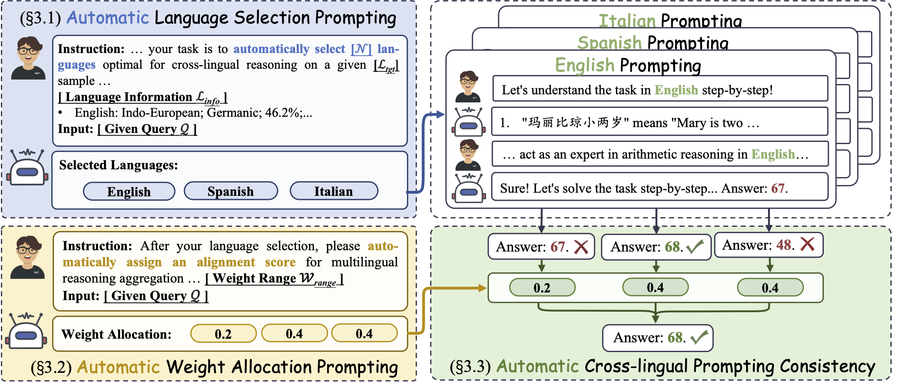
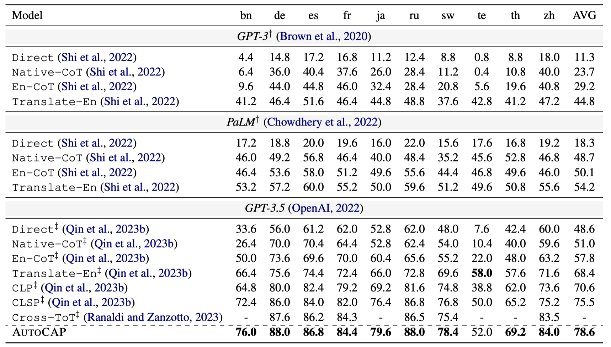

# AutoCAP: Towards Automatic Cross-lingual Alignment Planning for Zero-shot Chain-of-Thought


<div>


</div>

\
📷 This is the code repository for the paper: AutoCAP: Towards Automatic Cross-lingual Alignment Planning for Zero-shot Chain-of-Thought.

<div>

</div>
The overall workflow of AutoCAP, which consist of Automatic Language Selection Prompting and Automatic Weight Allocation Prompting.

## Preparation steps: environment installation
Environment installation command:
```python
pip install -r requirements.txt
```


## 💻 Stage 1: Automatic Language Selection Prompting
First modify the output path /temperature in `manage_res_request.py`:
```python
INPUT_DIR = "mgsm/input"
OUTPUT_DIR = "auto-clsp-exp/mgsm/l6-01-tp02-tp02"
TEMPERATURE_1 = 0.2
TEMPERATURE_2 = 0.2
```

---
【OPENAI KEY modification request.py】
```
--request_url [end url]
--api_key [api key]
```
---

Run the following command to request Automatic Language Selection Prompting and Automatic Weight Allocation Prompting.
```python
python manage_res_request.py
```
## 💻 Stage 2: Request missing CLP/evaluation metrics
Modify `SELECTION_PATH` to `f'{OUTPUT_DIR}/output-2'` from the previous stage:

---
【OPENAI KEY modification tool.py】
```
openai.api_key [api key]
openai.api_base [end url]
```
---

Run the following command to request Automatic Language Selection Prompting and Automatic Weight Allocation Prompting.
```python
python metric4auto.py
```

## 📌 Model Performance
<div>

</div>