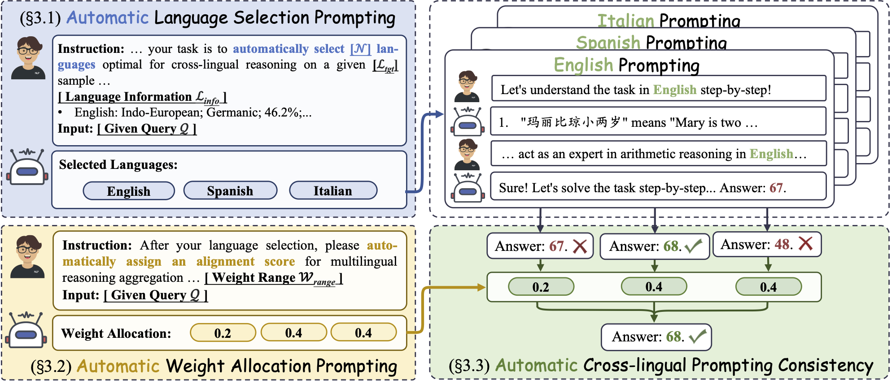
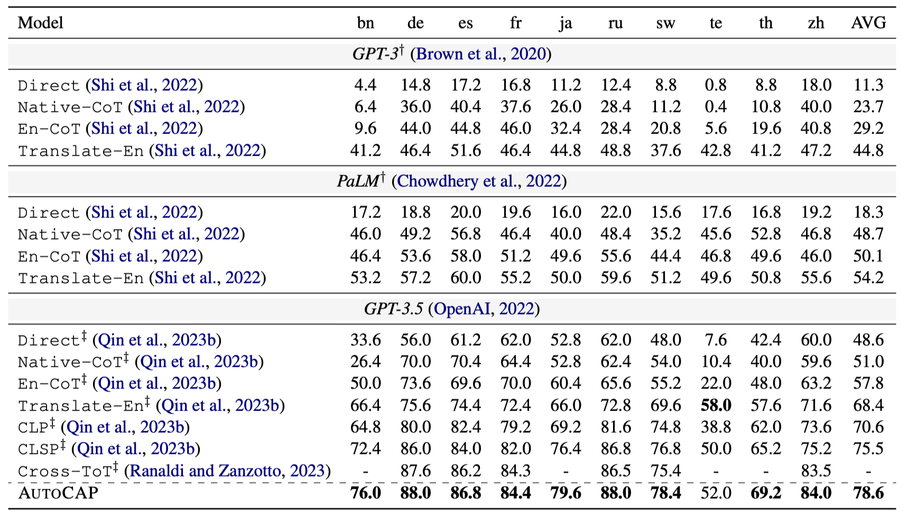

# AutoCAP: Towards Automatic Cross-lingual Alignment Planning for Zero-shot Chain-of-Thought


<div>


</div>

\
📷 This is the code repository for the paper: AutoCAP: Towards Automatic Cross-lingual Alignment Planning for Zero-shot Chain-of-Thought. **ACL 2024 Findings***.[[PDF]](https://aclanthology.org/2024.findings-acl.546.pdf) 

<div>

</div>
The overall workflow of AutoCAP, which consist of Automatic Language Selection Prompting and Automatic Weight Allocation Prompting.

## Preparation steps: environment installation
Environment installation command:
```python
pip install -r requirements.txt
```


## 💻 Stage 1: Automatic Language Selection Prompting
First modify the output path /temperature in `manage_res_request.py`:
```python
INPUT_DIR = "mgsm/input"
OUTPUT_DIR = "auto-clsp-exp/mgsm/l6-01-tp02-tp02"
TEMPERATURE_1 = 0.2
TEMPERATURE_2 = 0.2
```

---
【OPENAI KEY modification request.py】
```
--request_url [end url]
--api_key [api key]
```
---

Run the following command to request Automatic Language Selection Prompting and Automatic Weight Allocation Prompting.
```python
python manage_res_request.py
```
## 💻 Stage 2: Request missing CLP/evaluation metrics
Modify `SELECTION_PATH` to `f'{OUTPUT_DIR}/output-2'` from the previous stage:

---
【OPENAI KEY modification tool.py】
```
openai.api_key [api key]
openai.api_base [end url]
```
---

Run the following command to request Automatic Language Selection Prompting and Automatic Weight Allocation Prompting.
```python
python metric4auto.py
```

## 💯 Model Performance
<div>

</div>


## 💬 Contact

Please create Github issues here or email [Yongheng Zhang](mailto:zyhbrz@gmail.com) or [Qiguang Chen](mailto:charleschen2333@gmail.com) or [Libo Qin](mailto:lbqin@csu.edu.cn) if you have any questions or suggestions.

## 📲 Reference

<pre>
@inproceedings{zhang-etal-2024-autocap,
    title = "{A}uto{CAP}: Towards Automatic Cross-lingual Alignment Planning for Zero-shot Chain-of-Thought",
    author = "Zhang, Yongheng  and
      Chen, Qiguang  and
      Li, Min  and
      Che, Wanxiang  and
      Qin, Libo",
    booktitle = "Findings of the Association for Computational Linguistics ACL 2024",
    month = aug,
    year = "2024",
    publisher = "Association for Computational Linguistics",
    url = "https://aclanthology.org/2024.findings-acl.546",
    doi = "10.18653/v1/2024.findings-acl.546",
    pages = "9191--9200",
}
</pre>
